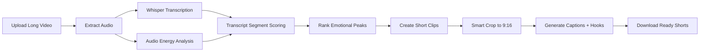

# AttentionX AI
**Automated Content Repurposing Engine for the UnsaidTalks AttentionX AI Hackathon**

AttentionX turns long-form videos such as lectures, podcasts, and workshops into short-form vertical clips with AI-generated captions, hooks, and smart highlight detection.

This project is designed directly around the hackathon brief:
- detect emotional peaks / high-impact moments
- convert long-form video to vertical short-form
- generate timed captions and catchy hooks
- provide a simple and polished user experience

## Why this stands out
1. **Hybrid highlight scoring**
   - Combines audio energy
   - Transcript intensity
   - keyword-based virality signals
   - speaking-density smoothing

2. **Hackathon-friendly architecture**
   - Streamlit UI for fast demo readiness
   - modular Python engine
   - works in both **demo mode** and **full AI mode**

3. **Practical fallback design**
   - If Whisper / FFmpeg / MediaPipe are not available, the app still demonstrates the flow end-to-end using transcript-driven scoring.

---

## Features
- Upload a long-form video
- Auto-transcribe audio with Whisper
- Detect the best “golden nugget” moments
- Generate short clips around the best moments
- Create hooks / headlines for each clip
- Produce SRT subtitles
- Export ready-to-review clips for Reels / Shorts / TikTok

---

## Tech Stack
- **Frontend**: Streamlit
- **Backend**: Python
- **Transcription**: faster-whisper
- **Video Editing**: MoviePy
- **Audio Analysis**: librosa, numpy
- **Face Detection / Smart Crop**: MediaPipe + OpenCV
- **Captions**: SRT generation
- **Configuration**: python-dotenv

---

## Project Structure
```text
AttentionX_Winning_Submission/
├── app.py
├── requirements.txt
├── .env.example
├── README.md
├── submission-text.txt
├── project-description.txt
├── demo-script.txt
├── assets/
│   └── logo.svg
├── engine/
│   ├── __init__.py
│   ├── config.py
│   ├── utils.py
│   ├── transcription.py
│   ├── highlights.py
│   ├── cropper.py
│   ├── captions.py
│   └── pipeline.py
└── outputs/
```

---

## Installation
### 1) Create virtual environment
```bash
python -m venv .venv
```

### 2) Activate it
**Windows**
```bash
.venv\Scripts\activate
```

**Mac/Linux**
```bash
source .venv/bin/activate
```

### 3) Install dependencies
```bash
pip install -r requirements.txt
```

### 4) Run the app
```bash
streamlit run app.py
```

---

## Environment Variables
Create a `.env` file using `.env.example`.

```env
WHISPER_MODEL=base
MAX_HIGHLIGHTS=3
CLIP_DURATION=45
PADDING_BEFORE=8
PADDING_AFTER=12
```

---

## How it works
### Step 1: Transcription
The app extracts audio from the uploaded video and transcribes it with timestamped segments using Whisper.

### Step 2: Highlight Scoring
Each transcript segment is scored with a weighted combination of:
- audio energy
- excitement keywords
- density of meaningful words
- short-form suitability

### Step 3: Clip Generation
Top-ranked segments are converted into short clips with pre/post padding.

### Step 4: Vertical Output
The clip is converted to a vertical format. If face tracking is available, the frame is centered dynamically around the speaker.

### Step 5: Captions + Hook
The app creates:
- `.srt` subtitle file
- hook/headline suggestions
- ranked clip descriptions

---

## Scoring formula
A simplified score is computed as:

```text
score =
0.40 * normalized_audio_energy
+ 0.35 * transcript_impact_score
+ 0.15 * keyword_virality_score
+ 0.10 * speaking_density_score
```

This hybrid approach improves clip selection compared with keyword-only methods.

---

## Demo flow for judges
1. Open the app
2. Upload a mentorship / lecture video
3. Click **Generate Shorts**
4. Review ranked highlights
5. Export clips and captions
6. Show the outputs folder

---

## Innovation points
- multi-signal highlight ranking instead of simple trimming
- practical dual-mode pipeline for hackathon reliability
- ready for educator / creator workflows
- can be extended with Gemini headline rewriting and virality ranking

---

## Future scope
- Gemini / LLM-powered hook improvement
- emotion classification from voice tone
- automatic B-roll suggestions
- social platform-specific export presets
- multilingual subtitles
- brand templates for creators

---

## Hosting
You can deploy the Streamlit version on:
- Streamlit Community Cloud
- Render
- Hugging Face Spaces

---

## Demo video link
Add your Google Drive demo video link here before submission:

```md
Demo Video: [Paste your Google Drive link here]
```

---

## Submission checklist
- [x] Public GitHub repository
- [x] Complete source code
- [x] README with explanation
- [ ] Demo video link added in README
- [ ] Hosted URL added if deployed
- [ ] Final repository link submitted on Unstop

---

## Architecture


---

## Important note
For the strongest demo, use a video where:
- one speaker is visible
- audio is clean
- there are clear energetic or insightful moments
- duration is 3 to 20 minutes

This makes the app look significantly better during judging.
